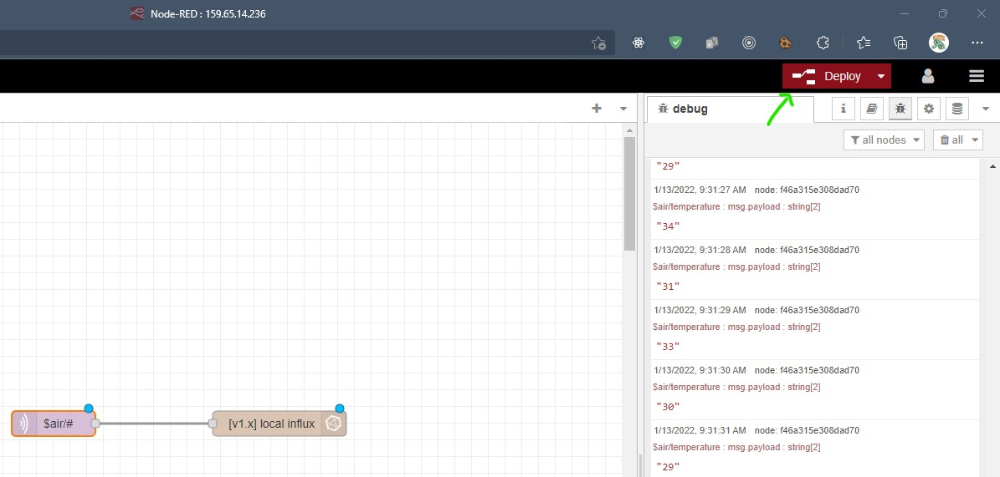

## Remote Access Server

PuTTY adalah aplikasi open-source yang sering digunakan untuk melakukan remote access, seperti RLogin, SSH dan Telnet.

> Remote access merupakan aplikasi yang digunakan untuk mengendalikan sistem dari jarak jauh atau di tempat yang berbeda. Remote access masih terkoneksi dengan jaringan internet.

Pemilik server kebanyakan menggunakan aplikasi ini untuk melakukan akses ke server mereka. Letak server yang jauh membuat PuTTY sangat berguna, karena tidak perlu datang langsung ke lokasi server untuk melakukan konfigurasi.

### Instalasi

-   PuTTY dapat di download pada link berikut [download PuTTY](https://www.chiark.greenend.org.uk/~sgtatham/putty/latest.html) dan pilih installer yang sesuai dengan OS
-   Lakukan instalasi hingga selesai
-   PuTTY sudah terinstall<br>
    

### Melakukan Koneksi

1. Buka PuTTY
2. Masukan IP Server yang akan diremote<br>
3. Masukan Port yang digunakan untuk melakukan remote server. Biasanya menggunakan port 22 (SSH)<br>
4. Klik Open untuk melakukan koneksi ke server<br>
5. Masukan username yang digunakan untuk login<br>
6. Masukan Password<br>
7. Berhasil masuk ke server menggunakan PuTTY<br>

---

## MQTT Broker

> MQTT adalah protokol messaging yang dibentuk dengan TCP/IP berdasarkan model messaging publish-subscribe. **Publisher mengirim pesan, subscriber menerima pesan** yang mereka akan gunakan, dan broker akan menyampaikan pesan dari pengirim ke penerima.

Publisher dan subscriber adalah klien MQTT yang hanya berkomunikasi dengan broker MQTT. Klien MQTT dapat berupa perangkat atau aplikasi apapun (dari mikro kontroler seperti Arduino sampai dengan aplikasi yang di host di Cloud) yang menjalankan MQTT library dan mengkoneksikan ke broker MQTT melalui sebuah jaringan. Broker MQTT mengelola penerimaan pesan dari publisher dan pengiriman pesan ke subscriber (dan juga mengelola daftar topik yang digunakan subscriber).

### Instalasi

#### Ubuntu

1. **Update System Package**<br>

    ```sh
    sudo apt update
    ```

2. **Install Mosquitto**<br>

    ```sh
    sudo apt install -y mosquitto
    ```

3. **Pengecekan Status Mosquitto**<br>

    ```sh
    sudo systemctl status mosquitto
    ```

    apabila command dijalankan dan muncul pesan seperti dibawah, maka mosquitto sudah berjalan
    <br>

    

4. **Mengelola Mosquitto** - setelah terinstal anda dapat menggunakan beberapa command untuk mengelola mosquitto anda:

    - `stop` mosquitto service<br>

        ```sh
        sudo systemctl stop mosquitto
        ```

    - `start` **mosquitto** service<br>

        ```sh
        sudo systemctl start mosquitto
        ```

    - `restart` **mosquitto** service<br>

        ```sh
        sudo systemctl restart mosquitto
        ```

    - `status` **mosquitto** service<br>

        ```sh
        sudo systemctl status mosquitto
        ```

---

## Node-RED

Node-RED adalah suatu alat pemograman untuk menghubungkan perangkat-perangkat keras, API, dan layanan online dengan cara yang baru dan menarik. Node-RED memberikan editor berbasis browser yang memudahkan pengguna untuk menghubungkan flow dengan penggunaan node yang luas di dalam palette yang dapat langsung diterapkan dengan satu klik.

Node-RED digunakan bersama dengan Antares, MQTT, dan platform/protokol lain. Setelah terpasang, Node-RED dapat dijalankan dengan mengetik “node-red” pada command prompt.

### Prerequisite

-   Install **node.js** dan **NPM**

    1. **Update** Package<br>

        ```sh
        sudo apt update
        ```

    2. **Install Node.js** - Node.js dibutuhkan untuk menjalankan Node-RED yang menggunkan javascript<br>

        ```sh
        sudo apt install nodejs
        ```

    3. **Install NPM** - NPM sebagai tools untuk melakukan instalasi dependecies atau package yang dibutuhkan Node-RED<br>

        ```sh
        sudo apt install npm
        ```

-   Install `screen` untuk menjalankan Node-RED secara background meskipun PuTTY sudah dimatikan. Untuk menginstallnya dapat menggunakan command

    ```sh
    sudo apt-get install screen
    ```

### Install **Node-RED** menggunkan NPM<br>

```sh
sudo npm install -g --unsafe-perm node-red
```

### Start Node-RED<br>

1.  Membuat session baru dengan nama `node-red`<br>

    ```sh
    screen -S node-red
    ```

2.  Menjalankan Node-RED<br>

    ```sh
    node-red
    ```

3.  Buka Node-RED pada web browser dengan alamat `http://ip_server:1880`<br>

    

4.  Untuk detached dari screen node-red dapat menggunakan command `ctrl + A, D`

### Mematikan Node-RED

Untuk kill screen node-red dapat menggunakan perintah<br>

```sh
screen -r node-red
```

kemudian `ctrl + C` untuk mematikan node-red

### Securing Node-RED

1. Generate password baru<br>
    ```sh
    node-red admin hash-pw
    ```
2. Masukan password anda (ketika anda mengetik password tidak akan muncul karakternya)
3. Copy hasil hashing password anda
4. Buka file `settings.js`<br>

    ```sh
    nano .node-red/settings.js
    ```

5. Uncomment block kode dibawah ini. Kemudian ganti `username` yang sesuai serta ganti `password` dengan hashing password yang sudah anda copy<br>

    ```js
    adminAuth: {
        type: "credentials",
        users: [{
            username: "admin",
            password: "$2a$08$zZWtXTja0fB1pzD4sHCMyOCMYz2Z6dNbM6tl8sJogENOMcxWV9DN.",
            permissions: "*"
        }]
    },
    ```

    
    
    ```
    node-red
    ```
    
    Click CTRL + A, D
---

## Influx DB

InfluxDB adalah sebuah database time series open-source yang dikembangkan oleh InfluxData. InfluxDB didukung oleh Bahasa Go dan dioptimalkan untuk penyimpanan data dalam waktu cepat seperti pemantauan operasi, metrik aplikasi, sensor data Internet of Things (IoT) dan analisis real-time.

### Instalasi

-   Instalasi DB Server<br>

    ```sh
    sudo apt install influxdb
    ```

-   Instalasi DB Client<br>

    ```sh
    sudo apt install influxdb-client
    ```

### Mengelola influx DB

-   `stop` influxdb service<br>

    ```sh
    sudo systemctl stop influxdb
    ```

-   `start` **influxdb** service<br>

    ```sh
    sudo systemctl start influxdb
    ```

-   `restart` **influxdb** service<br>

    ```sh
    sudo systemctl restart influxdb
    ```

-   `status` **influxdb** service<br>

    ```sh
    sudo systemctl status influxdb
    ```

### Membuat DB

-   Untuk menjalankan DB client dapat menggunakan perintah `influx`<br>
    ```sh
    influx
    ```
-   Sedangkan untuk untuk membuat database dapat menggunakan perintah<br>

    ```sql
    CREATE DATABASE AIR
    ```

    Dimana `AIR` merupakan nama dari database

-   Menampilkan list database
    ```sql
    SHOW DATABASES
    ```

Apabila berhasil maka akan tertampil pesan seperti pada gambar dibawah<br>


---

## Mengirim Data ke MQTT Menggunakan Python

`paho-mqtt` adalah salah satu library MQTT client yang dapat digunakan untuk `PUBLISH` atau `SUBSCRIBE` suatu topic.

### Prerequisite

-   Python 2.7^
-   Text editor

### Instalasi `paho-mqtt`

```sh
pip install paho-mqtt
```

### Mengirim Data ke MQTT Broker (Mosquitto)

Buat file `publisher.py` yang menghubngkan `paho-mqtt` dengan broker mqtt dengan port 1883 dan keepalive diset 60s serta akan mengirimkan data temperature secara random pada topic `$air/temperature`<br>

```python
# publisher.py
import paho.mqtt.client as mqtt
import random
import time

client = mqtt.Client()

# ganti sesuai dengan broker yang di inginkan
mqtt_broker = "159.65.14.236"

client.connect(mqtt_broker, 1883, 60)

for i in range(1000):
    time.sleep(2)
    client.publish("$air/temperature", random.randrange(27, 35).__float__())
```

---

## Print Data

### Subscribe Topic Tertentu

Buat file `subscriber.py` yang berisi instruksi subscribe ke topci tertentu. Untuk proses koneksi sama dengan sebelumnya hanya saja kita menambahkan fungsi `on_connect` untuk menjalankan suatu instruksi ketika mqtt berhasil terkoneksi seperti melakukan subscribe ke topic tertentu.

Selain itu kita juga menambahkan fungsi `on_message` untuk menjalankan suatu perintah tertentu ketika ada pesan yang masuk ke topic yang sudah kita subscribe.

Sedangkan untuk fungsi `client.loop_forever()` digunakan untuk menjalankan client secara terus menerus untuk _listen_ ke topic tertentu.<br>

```python
# subscriber.py
import paho.mqtt.client as mqtt

client = mqtt.Client()

# ganti sesuai dengan broker yang di inginkan
mqtt_broker = "159.65.14.236"

# fungsi ini akan berjalan ketika MQTT berhasil connect.
def on_connect(client, userdata, flags, rc):
    print("Connected with result code "+str(rc))
    # Subscribe ke suatu topic tertentu
    client.subscribe("$air/#")

# fungsi ini akan berjalan ketika ada message yang masuk
# ke topic yang sudah kita subscribe
def on_message(client, userdata, msg):
    print(msg.topic+" "+str(msg.payload))

client.on_connect = on_connect
client.on_message = on_message

client.connect(mqtt_broker, 1883, 60)

# client mqtt akan dijalankan terus menerus
client.loop_forever()
```

Maka akan muncul tampilan dibawah ini ketika publisher mengirimkan data ke topic `$air/temperature`<br>


---

## Menghubungkan MQTT dengan InfluxDB Menggunakan Node-RED

1. Install package `node-red-contrib-influxdb`

    1. Click hamburger menu pada kanan atas pada page<br>

        

    2. Click Manage Pallete<br>

        

    3. Pilih Tab Install<br>

        

    4. Ketikan `influxdb` pada search bar dan Install package `node-red-contrib-influxdb`<br>

        

2. Buka Node-RED pada browser dengan alamat `http://ip_address:1880`

3. Setting node `mqtt in`

    1. Cari node `mqtt in` dan drag-and-drop pada canvas<br>

        

    2. Click 2x pada node untuk menampilkan setting node

    3. Tambahkan Server MQTT baru

        <br>

    4. Masukan nama serta alamat IP dari server MQTT, lalu click Add<br>

        

    5. Subscribe Topic dengan server yang baru kita tambahkan, lalu click Done<br>

        

4. Setting node `influxdb out`

    1. Cari node `influxdb out` dan drag-and-drop pada canvas<br>

        

    2. Click 2x pada node untuk menampilkan setting node<br>

    3. Tambahkan Database baru dengan click gambar pencil<br>

    4. Masukan nama serta alamat IP dari server MQTT, lalu click Add<br>

        

    5. Gunakan DB Server baru kita tambahkan serta masukan Measurement yang sesuai, lalu click Done<br>

        

5. Hubungkan node `mqtt in` dan `influxdb out` yang sudah kita buat<br>

    

6. Click tombol deploy<br>

    

Jika berhasil maka node `mqtt in` akan tertulis connected<br>


Kemudian jalankan file `publisher.py`, maka akan muncul measurement baru yang sudah kita definsikan pada Node-RED<br>

1. Masuk ke DB dengan InfluxDB client<br>

    ```sh
    influx
    ```

2. Gunakan database yang sesuai, pada kasus diatas `air`<br>

    ```sql
    USE AIR
    ```

3. Tampilkan measurements dari database `air`<br>

    ```sql
    SHOW MEASUREMENTS
    ```

4. Select data pada measurement yang sesuai, pada kasus ini `$air/temperature`<br>

    ```sql
    SELECT * FROM "$air/temperature"
    ```

Jika berhasil maka akan tertampil measurements yang berisi data dengan key-nya adalah waktu serta value, dalam kasus ini temperature udara<br>


---

## Menampilkan Data di Grafana

Grafana merupakan aplikasi open-source untuk memonitor dan menganalisa metrics. Kita menggunakan Grafana untuk memvisualisasikan metrics menjadi grafik-grafik yang menarik untuk dilihat dan mudah dimengerti. Grafana memiliki banyak fitur yang powerful untuk memonitor dan menganalisa. Grafana juga memiliki fitur alerting yang sangat berguna. Feature ini telah banyak digunakan oleh ribuan perusahaan.

### Instalasi

1. Download GPG key<br>

    ```sh
    wget -q -O - https://packages.grafana.com/gpg.key | apt-key add -
    ```

2. Menambahkan repository Grafana<br>

    ```sh
    sudo add-apt-repository "deb https://packages.grafana.com/oss/deb stable main"
    ```

3. Install Grafana<br>

    ```sh
    sudo apt install grafana -y
    ```

4. Aktifkan Grafana dengan beberapa command<br>

    ```sh
    sudo systemctl enable grafana-server
    ```

    ```sh
    sudo systemctl start grafana-server
    ```

    ```sh
    sudo systemctl status grafana-server
    ```

5. Buka Grafana pada browser dengan alamat `http://<ip_server>:3000`, maka akan muncul tampilan dibawah ini<br>

    

### Mengelola Grafana

-   `stop` grafana-server service<br>

    ```sh
    sudo systemctl stop grafana-server
    ```

-   `start` **grafana-server** service<br>

    ```sh
    sudo systemctl start grafana-server
    ```

-   `restart` **grafana-server** service<br>

    ```sh
    sudo systemctl restart grafana-server
    ```

-   `status` **grafana-server** service<br>

    ```sh
    sudo systemctl status grafana-server
    ```

### Menampilkan Grafik

1. Setelah melakukan login, maka akan muncul tampilan seperti di bawah ini
2. Tambahkan datasource baru

    1. Click card add datasource<br>

        

    2. Pilih InfluxDB<br>

        

    3. Masukan alamat URL dari database serta Database yang akan digunakan<br>

        

    4. Click save & test<br>

        

3. Tambahkan dashboard baru

    1. Click card create your first dashboard<br>

        

    2. Click Add Panel<br>

        

    3. Pilih datasource dan Measurement yang akan digunakan<br>

        

Jika berhasil maka akan tertampil<br>


